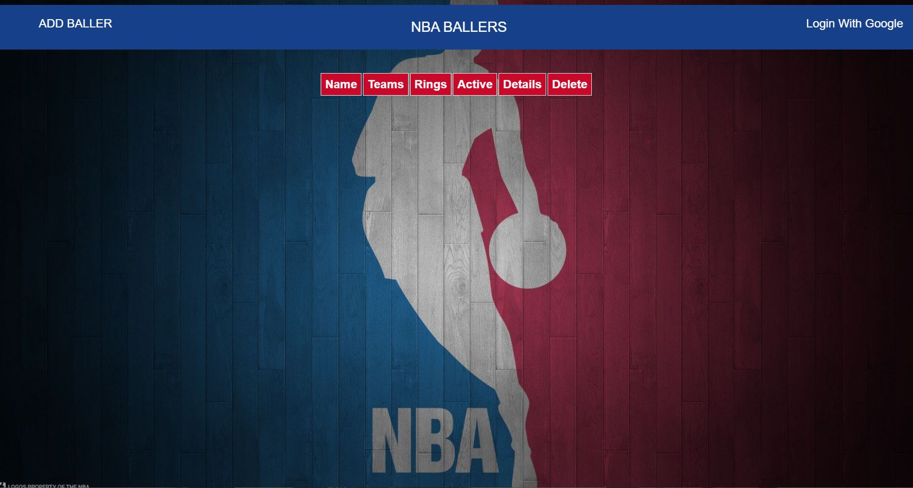
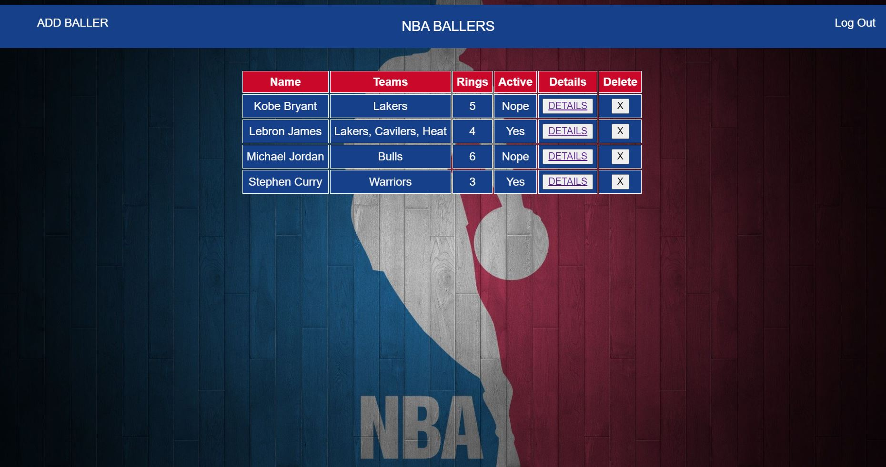
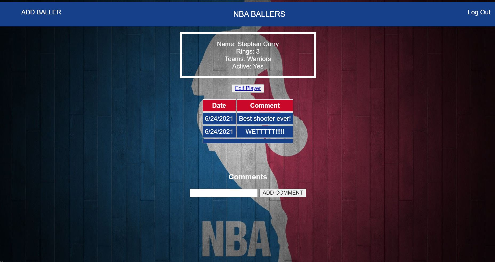

# NBA BALLERS

Want to track your favorite NBA players from past present? Well [NBA BALLERS](https://nba-ballers98.herokuapp.com/players) is for you! Just add your BALLER by entering in some basic information and bam just like that you can see your all your favortie players on screen. 

## Wireframes 

## Technologies Used:

- Node.js
- MongoDB
- Express
- Mongoose
- HTML
- CSS

## Getting Started 

1. Click the [link](https://nba-ballers98.herokuapp.com/players) to open my app in browser.
2. Login via google by clicking login button in top right corner
3. Add a Baller by clicking the ADD Baller button in left corner.
4. Fill out form for player and press add baller.
5. Edit baller from the baller details page you are greeted with after creating player
6. See all players added by clicking NBA ballers button at top
7. From NBA ballers page you can delete players you no longer want to see 

[Trello](https://trello.com/b/05Za5meR/nba-player-team-tracker)

## Next Steps

1. AAU, I want to search for players & teams via a text search bar.(API)
2. AAU, I should be able to add players  searched to baller page by clicking on player or team.(API)
3. AAU, I should be able see career stats for teams and players in profile (API)
4. Make site prettier